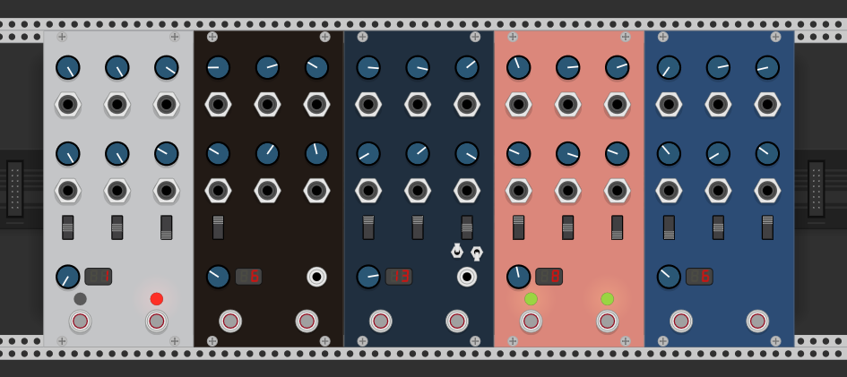

# vcv-robrichards

VCV Plugins by RobRichards

Here you'll find unofficial Midi controller plugins for various Chase Bliss Audio Pedals.

Current supported interfaces:

* Thermae
* Dark World
* Warped Vinyl
* M O O D
* Generation Loss
* Blooper

**NOTE: In order to use these modules, you will need the physical CBA pedals, a MIDI-to-TRS converter (e.g. 'Chase Bliss Audio Midibox'), and a USB-to-MIDI Cable.**

Enjoy.

## Installation Steps

Since these are not distributable on the VCV plug-in library (yet), you'll have to compile
from source and install locally into your Rack Installation.

To do this, first set up your development environment for your platform using this guide: https://vcvrack.com/manual/Building.html#setting-up-your-development-environment.

**Note: you do not need to compile Rack.**

You will then need to download the most recent version of the [Rack SDK](https://vcvrack.com/downloads/Rack-SDK-1.1.6.zip) and unzip it to some directory (e.g. ~/Downloads/Rack-SDK). 

Finally, clone this git repo, change directories into it, and run the following to compile and install the plugin in your Rack installation.

`RACK_SDK=~/Downloads/Rack-SDK make install`

Then launch Rack.

## Features
* Dynamic modulation of all knobs using CV inputs, via CV->CC 
* 3-way programmable switches (All)
* Stomp switch controls (All)
* Expression CV Input (All)
* Clock SYNC inputs (Thermae, Warped Vinyl, & Blooper)
* Tap Tempo switch (Thermae & Warped Vinyl)
* "Slow-down" mode toggle (Thermae)
* "Self-oscillation/Hold" mode via momentary toggle (Thermae)
* Midi Note tempo divisions (Warped Vinyl)
* Modifier Toggles (Blooper)